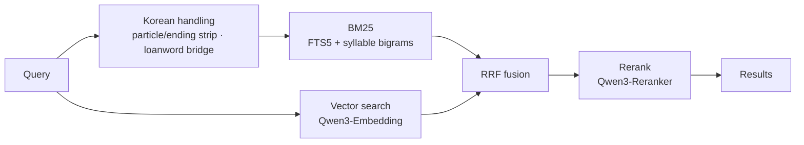

# ko-qmd — local hybrid search for Korean Markdown notes

[](https://www.npmjs.com/package/ko-qmd)
[](LICENSE)

[한국어](README.md) · **English**

**ko-qmd is an on-device search engine for Korean Markdown notes — Obsidian vaults, wikis, meeting
notes and docs folders — that finds them by keyword or by natural-language question.**
It combines BM25 full-text search, vector search and LLM reranking, and matches Korean query words
by their stem even when a particle or verb ending is attached. Every model runs locally through
[node-llama-cpp](https://github.com/withcatai/node-llama-cpp) (GGUF, no network calls), so your notes
never leave the machine. AI agents such as Claude Code and Claude Desktop use it through the CLI, an
MCP server, a REST endpoint or the TypeScript SDK.
It is the Korean distribution of [tobi/qmd](https://github.com/tobi/qmd) (MIT).

- Package: `ko-qmd` on npm. The binary and MCP server keep the upstream name, `qmd`
- Version: `<upstream version>-ko.N` (e.g. `2.8.3-ko.5`)
- Full reference (every CLI option, MCP tool parameters, SDK API, scoring): [docs/REFERENCE.md](docs/REFERENCE.md)
- Changes: [CHANGELOG.md](CHANGELOG.md) · [FAQ](#faq)



## What differs from upstream qmd

### Korean keyword search (lex)

- **Particle and ending stripping** — an unquoted Hangul word also matches its stem: one trailing particle
  (`검색을` → `검색`), a two-particle chain (`청킹에서의` → `청킹`), verb and nominalizing endings
  (`토큰화하는` → `토큰화`, `검색하기` → `검색`), `한`/`된` endings (`필요한` → `필요`) and the 하↔해
  contraction. Quoted phrases, Hanja and kana are left as written.
- **Loanword bridge** — about 80 built-in Hangul spellings of technical terms (`서치`, `웹`, `코어`,
  `마이그레이션`, …) also search their English spelling, so `하이브리드 서치` finds a `hybrid-search` note.
  Only the query changes; no re-index is needed.
- **Mixed-script token split** — `SKILL.md계약의핵심` becomes `skill` AND `md` AND `계약의핵심`.
- **Long-query relaxation** — a query of three or more words that matches nothing with AND is retried with
  OR, so a natural-language sentence never returns zero hits.
- **Syllable-bigram index** — Hangul runs are indexed as syllable bigrams too, so a word inside a
  compound written without spaces still matches.
- **Negation strip** — "X 말고 Y" ("Y, not X") searches for Y alone.

### Models and chunking

| Role | Default model | Upstream |
|---|---|---|
| Embedding | `Qwen3-Embedding-0.6B` (Q8_0) | embeddinggemma-300M |
| Rerank | `Qwen3-Reranker-0.6B` (Q8_0) | same |
| Query expansion | `qmd-query-expansion-1.7B` | same |

- Korean documents are chunked by their real token budget: Hangul costs far more tokens per character
  than English (measured on Qwen3-Embedding: 1.64 chars/token for Korean, 6.08 for English). English
  chunk boundaries match upstream.
- Hybrid RRF weights are tuned for Korean, and a query containing Hangul skips LLM query expansion on
  the hybrid path (English queries are still expanded).
- The rerank blend lets the reranker actually change the top result, and the reranker is shown the
  chunk that best matches the query's Hangul syllable bigrams, led by the note title.

### Scope, tools and daemon

- **Path and time scope** — CLI `--path` / `--since` / `--until`, the same fields over REST and MCP,
  `scope` in the SDK. Ranking happens inside the filtered corpus.
- **`qmd grep`** — exact string or regex match over indexed bodies, for spellings the tokenizer never
  produced.
- **Daemon** — re-indexes changed files before a search (once per collection every 30 s), optional query
  log (`QMD_QUERY_LOG=1`), raw `vec_score` / `fts_score` with `rerank:false`, and a per-document
  rerank token cap (`QMD_RERANK_MAX_DOC_TOKENS`, or `rerankMaxDocTokens` per request).

## Install

```sh
npm install -g ko-qmd            # or pin: ko-qmd@2.8.3-ko.5
```

- It cannot sit beside upstream `@tobilu/qmd` (same binary name): `npm uninstall -g @tobilu/qmd` first.
- Requires Node.js 22+ or Bun; on macOS, Homebrew SQLite (for extension loading). Models download to
  `~/.cache/qmd/models/` on first use.

## Quick start

```sh
qmd collection add ~/notes --name notes          # register and index a folder
qmd context add qmd://notes "Personal dev notes" # description returned with results
qmd embed                                         # vector embeddings (first time, then changes only)

qmd query "하이브리드 서치 설계 결정"               # fusion + rerank (recommended)
qmd search "리랭크"                               # BM25 only (fast, no model)
qmd vsearch "검색 지연을 줄인 방법"                 # vector only
qmd grep "QMD_QUERY_LOG"                          # exact body match
qmd get "#abc123"                                 # fetch by docid
```

Common options: `-c <collection>` · `-n <count>` · `--min-score <score>` · `--full` ·
`--intent "<what you are after>"` · `--no-rerank` · `--format json|csv|md|xml|files`.

## Use from AI agents

```sh
qmd mcp                          # stdio MCP server (Claude Desktop, Claude Code, …)
qmd mcp --http                   # HTTP on port 8181 — models load once, sessions share them
qmd mcp --http --daemon          # background; stop with qmd mcp stop
```

The HTTP daemon serves `POST /mcp` (MCP Streamable HTTP), `POST /query` (REST) and `GET /health`.

```sh
curl -s http://127.0.0.1:8181/query -H 'Content-Type: application/json' -d '{
  "searches": [{"type": "vec", "query": "리랭크 지연"}, {"type": "lex", "query": "리랭크 지연"}],
  "collections": ["notes"], "limit": 10
}'
```

```ts
const { createStore } = await import('ko-qmd')   // ESM only — require() does not work

const store = await createStore({ dbPath: './index.sqlite', configPath: `${process.env.HOME}/.config/qmd/index.yml` })
const results = await store.search({
  queries: [{ type: 'vec', query: '리랭크 지연' }, { type: 'lex', query: '리랭크 지연' }],
  collection: 'notes', limit: 10,
})
await store.close()
```

Tool list, request fields and SDK API: [docs/REFERENCE.md](docs/REFERENCE.md). Search guidance for
agents, including a section on Korean queries: [skills/qmd/SKILL.md](skills/qmd/SKILL.md).

## Benchmark

`bash scripts/bench-ko.sh` runs the `test/fixtures/ko-vault/` fixture (97 documents, 93 queries).
On its first 52 queries, bm25 recall@5 went from 0.6250 on upstream 2.8.3 to 0.9519 in this
distribution. Every run's numbers are in [BASELINE.md](test/fixtures/ko-vault/BASELINE.md).

## FAQ

### What is ko-qmd?
A CLI, MCP server and SDK that search Korean Markdown notes on your own machine. It adds Korean
particle and ending handling, a Hangul syllable-bigram index, a Korean-friendly default embedding
model (Qwen3-Embedding) and tuned fusion weights on top of upstream qmd.

### Why not use upstream qmd for Korean?
Upstream BM25 treats a word with a particle attached (`검색을`, `청킹에서의`) as a different token from
its stem, so it misses notes that say `검색`. On the ko-vault benchmark (52 queries) bm25 recall@5 is
0.6250 upstream and 0.9519 here.

### Can it search an Obsidian vault?
Yes. Register the vault folder with `qmd collection add <vault path> --name <name>` and it indexes the
`*.md` files inside. It only reads your files.

### Does it need internet access or an API key?
No. The embedding, rerank and query-expansion models download once on first use and run offline after
that.

### How do I connect it to Claude Code or another agent?
Start the MCP server with `qmd mcp` (stdio) or `qmd mcp --http --daemon` (HTTP, shared models). See
[Use from AI agents](#use-from-ai-agents).

### Does it work for English notes too?
Yes. English queries and documents behave as upstream: same chunk boundaries, same query expansion.
Korean and English notes can live in one index.

## Development

```sh
bun install
bun src/cli/qmd.ts <command>     # run from source
bun run lint && bun run test:types
npx vitest run --reporter=verbose test/
npm run build                    # dist/ — never `bun build --compile` (it breaks sqlite-vec)
```

`develop` is the working branch (PRs go there); `main` is the release branch. Release, dogfood and
upstream-sync procedures are documented in Korean in [README.md](README.md#개발).

## License

MIT. Original copyright Tobi Lutke ([LICENSE](LICENSE)); this distribution uses the same license.
