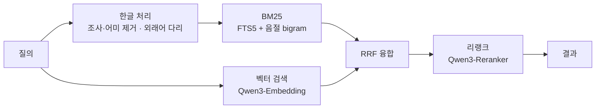

# ko-qmd

한국어 마크다운 노트를 위한 로컬 검색 엔진. [tobi/qmd](https://github.com/tobi/qmd)(MIT)의 한국어 배포판이다.
노트·회의록·문서를 색인해 키워드로도 자연어로도 찾고, 에이전트가 CLI·MCP·REST·SDK 로 쓴다.
모든 모델은 [node-llama-cpp](https://github.com/withcatai/node-llama-cpp) 로 로컬에서 돈다(GGUF, 네트워크 호출 없음).

- 패키지: `ko-qmd` (npm). 실행 파일과 MCP 서버 이름은 업스트림과 같은 `qmd`
- 버전: `<업스트림 버전>-ko.N` (예: `2.8.3-ko.4`)
- 영어 레퍼런스(전체 CLI 옵션·MCP 툴 파라미터·SDK API·점수 계산): [docs/REFERENCE.md](docs/REFERENCE.md)
- 변경 이력: [CHANGELOG.md](CHANGELOG.md)



## 업스트림과 다른 점

### 한국어 키워드 검색 (lex)

- **조사·어미 제거** — 따옴표 없는 한글 단어는 어간도 매칭한다. 끝 조사 하나(`검색을` → `검색`), 두 조사 연쇄(`청킹에서의` → `청킹`),
  동사·명사화 어미(`토큰화하는` → `토큰화`, `검색하기` → `검색`), `한`/`된` 어미(`필요한` → `필요`), 하↔해 축약(`더하` ↔ `더해`).
  따옴표 구문·한자·가나는 그대로 둔다.
- **외래어 다리** — 기술 용어의 한글 표기(`서치`·`웹`·`코어`·`마이그레이션` 등 약 80개 내장 표)는 영문 표기도 함께 찾는다.
  `하이브리드 서치`가 `hybrid-search` 노트를, `레몬 웹 코어`가 `lemon-web-core`를 찾는다. 질의 쪽만 바뀌므로 재색인은 필요 없다.
- **문자 체계가 섞인 토큰 분리** — `SKILL.md계약의핵심`은 `skill` AND `md` AND `계약의핵심`으로 나눈다.
- **긴 질의 완화** — 세 단어 이상 질의가 AND 로 한 건도 안 맞으면 같은 단어를 OR 로 다시 찾는다. 자연어 문장 질의가 0건이 되지 않는다.
- **음절 bigram 색인** — 한글 구간의 음절 bigram 을 FTS 필드에 덧붙인다. 붙여 쓴 복합어 안의 단어도 걸린다.
  기존 인덱스는 처음 열 때 FTS 를 한 번 다시 만든다.

### 기본 모델과 청킹

| 역할 | 기본 모델 | 업스트림 |
|---|---|---|
| 임베딩 | `Qwen3-Embedding-0.6B` (Q8_0) | embeddinggemma-300M |
| 리랭크 | `Qwen3-Reranker-0.6B` (Q8_0) | 같음 |
| 질의 확장 | `qmd-query-expansion-1.7B` | 같음 |

- 한국어 문서는 실제 토큰 예산으로 청킹한다. 한글은 글자당 토큰이 영어보다 훨씬 많다(Qwen3-Embedding 실측 ko 1.64 / en 6.08 chars/token).
  그래서 청크 크기는 한글·기타 문자의 조화 평균으로 잡는다. 영어 문서의 청크 경계는 업스트림과 같다.
- 하이브리드 RRF 가중치를 한국어에 맞게 조정했다. 벡터 목록은 절반, OR 로 완화한 lex 목록은 다시 절반, 확장 질의 목록은 0.75 로 센다.
- `qmd query`·MCP plain `query`·SDK `search({ query })` 의 하이브리드 경로에서 한글이 한 글자라도 든 질의는 LLM 질의
  확장을 하지 않는다(명시적 `expand:` 포함, `qmd vsearch` 는 아직 확장한다). 확장 모델은 한국어 질문에 영어 문장 틀과 중국어를 섞어 썼고,
  그 샘플링만으로 어려운 질의 1위가 실행마다 30개 중 5개까지 바뀌었다. 끄자 어려운 질의 1위는 줄지 않았고 hybrid 지연은
  질의당 약 1초에서 수십 ms 로 줄었다(BASELINE.md 2026-09-26). 영어 질의는 그대로 확장한다.
- 리랭커가 실제로 1위를 바꿀 수 있게 점수 블렌드를 고쳤다. 검색 순위 항은 블렌드의 10% 인 선형 감쇠다.
  이전 블렌드에서는 리랭크 점수와 상관없이 검색 1위가 그대로 남았다.

### 검색 범위와 도구

- **경로·시간 범위** — CLI `--path`·`--since`·`--until`, REST·MCP `path`·`since`·`until`, SDK `scope`.
  걸러진 코퍼스 안에서 순위를 매긴다(전역 top-K 를 뽑은 뒤 거르는 방식이 아니다). metadata 필터(`filter`)와 같이 주면 AND 다.
- **`qmd grep`** — 색인된 본문을 문자열이나 정규식으로 정확히 찾는다(순위 없음). 토크나이저가 못 만든 한국어 표기를 찾을 때 쓴다.
- **`limit` 과 검색 폭 분리** — `limit` 은 돌려줄 개수만 정한다. 검색은 최소 20 문서를 본다.

### 데몬(HTTP MCP 서버) 기능

- **색인 자동 갱신** — 검색 전에 대상 컬렉션을 확인하고(컬렉션당 30초에 한 번) 바뀐 파일을 다시 색인한다.
  데몬이 도는 중에 쓴 노트가 `qmd update` 없이 다음 검색에서 키워드로 잡힌다. 벡터는 `qmd embed` 뒤에 반영된다.
- **질의 로그** — `QMD_QUERY_LOG=1` 이면 REST `/query` 와 HTTP MCP `query` 호출마다 `~/.cache/qmd/queries-YYYY-MM.jsonl` 에 한 줄을 남긴다
  (결과 경로·점수·소요 시간, 스니펫 없음). 헤더 `X-QMD-Tag`·`X-QMD-Qid`·`X-QMD-Role`·`X-QMD-No-Log` 로 행에 표시를 단다.
  계약: [docs/REFERENCE.md § Query log](docs/REFERENCE.md#query-log-ko-qmd).
- **원시 점수** — `rerank:false` 응답의 결과마다 `vec_score`(코사인 유사도)·`fts_score`(정규화 BM25)가 붙는다.
  그 경로의 `score` 는 1/순위라 임계값을 걸 수 없기 때문이다.
- **모델 상주** — `QMD_LLM_IDLE_TIMEOUT_MS=0` 이면 모델을 내리지 않는다. 기본은 5분 idle 뒤 내린다.
- **리랭크 입력 cap** — 리랭커에 보내는 문서당 토큰을 자른다. 데몬 전체는 `QMD_RERANK_MAX_DOC_TOKENS`,
  요청 하나는 REST `rerankMaxDocTokens` 로 건다(요청 값이 우선). KB 골드셋에서 128토큰 cap 은 품질을 지키면서
  콜드 p90 을 3.6s → 0.9s 로 줄였다(Apple M3 Max, 후보 15).

## 설치

```sh
npm install -g ko-qmd            # 또는 버전 핀: ko-qmd@2.8.3-ko.4
```

- 업스트림 `@tobilu/qmd` 와 실행 파일 이름이 같아 함께 둘 수 없다. `npm uninstall -g @tobilu/qmd` 뒤 설치한다.
- 버전이 prerelease(`-ko.N`)라 `^`·`~` 범위는 같은 `major.minor.patch` 의 `-ko.*` 안에서만 움직인다. 앱에서는 정확한 버전으로 핀한다.
- 미발행 커밋은 `npm i github:tak-bro/ko-qmd#<sha>` 로 받는다. `prepare` 가 `tsc` 로 `dist/` 를 만든다. 설치에는 node 와 tsc 만 필요하다.
- 요구 사항: Node.js 22+ 또는 Bun, macOS 는 Homebrew SQLite(확장 로드용). 모델은 첫 사용 때 `~/.cache/qmd/models/` 로 내려받는다.

## 빠른 시작

```sh
qmd collection add ~/notes --name notes          # 컬렉션 등록 + 색인
qmd context add qmd://notes "개인 개발 노트"       # 검색 결과와 함께 돌려줄 설명
qmd embed                                         # 벡터 임베딩 (처음 한 번, 이후 변경분만)

qmd query "하이브리드 서치 설계 결정"               # 융합 + 리랭크 (권장, 한글 질의는 확장하지 않는다)
qmd search "리랭크"                               # BM25 만 (빠름, 모델 없음)
qmd vsearch "검색 지연을 줄인 방법"                 # 벡터만
qmd grep "QMD_QUERY_LOG"                          # 본문 정확 일치

qmd get "#abc123"                                 # docid 로 문서 가져오기
qmd get notes/plan.md:100:40                      # 100행부터 40행
```

자주 쓰는 옵션: `-c <컬렉션>` · `-n <개수>` · `--min-score <점수>` · `--full` · `--intent "<찾는 것>"` · `--no-rerank` ·
`--format json|csv|md|xml|files` · `--path`·`--since`·`--until`.
전체 명령은 `qmd --help` 와 [docs/REFERENCE.md § Usage](docs/REFERENCE.md#usage).

컬렉션·모델 설정은 `~/.config/qmd/index.yml` 에 둔다. 프로젝트별 인덱스는 `qmd init` 으로 `.qmd/` 를 만든다.
기본 임베딩을 바꾸면 벡터가 호환되지 않으므로 `qmd embed -f` 로 전부 다시 임베딩한다.

## 에이전트에서 쓰기

### MCP 서버

```sh
qmd mcp                          # stdio (Claude Desktop·Claude Code 등)
qmd mcp --http                   # HTTP, 기본 포트 8181 — 모델을 한 번만 올리고 여러 세션이 공유
qmd mcp --http --daemon          # 백그라운드, 끄기는 qmd mcp stop
```

HTTP 데몬은 `POST /mcp`(MCP Streamable HTTP), `POST /query`(REST), `GET /health` 를 연다.
툴 목록과 파라미터는 [docs/REFERENCE.md § MCP Server](docs/REFERENCE.md#mcp-server).
에이전트용 검색 지침은 스킬 `skills/qmd/SKILL.md` 에 있다. 한국어 질의 절이 따로 있다: `lex:` 에는 어간·영문 용어, `vec:` 에는 한국어 패러프레이즈.

### REST `/query`

```sh
curl -s http://127.0.0.1:8181/query -H 'Content-Type: application/json' -d '{
  "searches": [{"type": "vec", "query": "리랭크 지연"}, {"type": "lex", "query": "리랭크 지연"}],
  "collections": ["notes"], "limit": 10,
  "rerank": true, "candidateLimit": 15, "rerankMaxDocTokens": 128
}'
```

| 필드 | 뜻 |
|---|---|
| `searches` | `{type: lex\|vec\|hyde, query}` 목록 (필수). 질의 확장은 하지 않는다 |
| `collections` · `limit` · `minScore` | 범위·개수·최소 점수 |
| `rerank` · `candidateLimit` | 리랭크 여부(기본 켜짐)·리랭크할 후보 수(기본 40) |
| `rerankMaxDocTokens` | 이 요청의 리랭크 문서당 토큰 cap. 양의 정수만 받고 나머지는 무시 |
| `path` · `since` · `until` · `filter` · `intent` | 경로·시간 범위, metadata 필터, 의도 힌트 |

### SDK

```ts
const { createStore } = await import('ko-qmd')   // ESM 전용 — require() 는 안 된다

const store = await createStore({ dbPath: './index.sqlite', configPath: `${process.env.HOME}/.config/qmd/index.yml` })
const results = await store.search({
  queries: [{ type: 'vec', query: '리랭크 지연' }, { type: 'lex', query: '리랭크 지연' }],
  collection: 'notes', limit: 10, rerank: true, candidateLimit: 15, rerankMaxDocTokens: 128,
})
await store.close()
```

API 전체: [docs/REFERENCE.md § SDK / Library Usage](docs/REFERENCE.md#sdk--library-usage).

## 환경 변수

| 변수 | 효과 |
|---|---|
| `QMD_QUERY_LOG` | `1`/`true`/`yes` 면 HTTP 데몬이 검색마다 질의 로그를 남긴다 |
| `QMD_LLM_IDLE_TIMEOUT_MS` | 모델을 내리기까지 idle ms (`0` = 내리지 않음) |
| `QMD_RERANK_MAX_DOC_TOKENS` | 리랭커에 보내는 문서당 토큰 cap (요청의 `rerankMaxDocTokens` 가 우선) |
| `QMD_RERANK_CONTEXT_SIZE` · `QMD_EMBED_CONTEXT_SIZE` · `QMD_EXPAND_CONTEXT_SIZE` | 역할별 context 크기 |
| `QMD_EMBED_PARALLELISM` | 병렬 context 수 (높으면 RAM/VRAM 고갈) |
| `QMD_LLAMA_GPU` · `QMD_FORCE_CPU` | GPU 백엔드 선택·끄기 |
| `QMD_CONFIG_DIR` | 설정 디렉터리 (XDG_CONFIG_HOME 보다 우선) |
| `QMD_EDITOR_URI` | 터미널 결과의 에디터 링크 템플릿 |

설정된 값과 그 영향은 `qmd doctor` 가 보여 준다.

## 아키텍처

- SQLite FTS5(BM25) + 한글 음절 bigram, sqlite-vec(벡터), RRF 융합, 리랭크 블렌드
- 청킹: 약 900토큰·15% 겹침, 마크다운 제목을 경계로 선호. 코드 파일은 `--chunk-strategy auto` 로 tree-sitter AST 경계(TS·JS·Python·Go·Rust)
- 인덱스: `~/.cache/qmd/index.sqlite`. LLM 결과 캐시(`llm_cache`)도 여기에 있다
- 점수 계산과 백엔드별 해석: [docs/REFERENCE.md § Score Normalization & Fusion](docs/REFERENCE.md#score-normalization--fusion)

## 개발

```sh
bun install
bun src/cli/qmd.ts <명령>        # 소스에서 실행
bun run lint                     # oxlint
bun run test:types               # tsc (tsconfig.build.json)
npx vitest run --reporter=verbose test/
bun test --preload ./src/test-preload.ts test/
npm run build                    # dist/ — `bun build --compile` 은 쓰지 않는다(sqlite-vec 이 깨진다)
```

- 브랜치: `develop` 이 작업 브랜치(PR 은 여기로), `main` 은 배포 브랜치다. 릴리스는 `/release <version>`(→ `v*` 태그 → `publish.yml` 이 npm 발행).
  절차와 CHANGELOG 규칙: [skills/release/SKILL.md](skills/release/SKILL.md).
- CI 는 업스트림 매트릭스에 `windows-latest` 와 Electron 스모크 잡을 더했다.

### dogfood — 작업 트리 빌드를 이 머신 데몬에 올리기

```sh
bash scripts/dogfood.sh              # 빌드 → bench-ko 게이트 → npm pack → npm i -g → 데몬 재시작 → 모델 워밍 → 스모크
bash scripts/dogfood.sh --restore    # 발행본(DOGFOOD_PIN_FILE 의 ko-qmd@<버전>, 없으면 latest)으로 되돌림
bash scripts/dogfood.sh --check "RESULT bm25_r5=…"   # 게이트 판정만
```

- 게이트: `bench-ko.sh` 의 `bm25_r5` 가 [BASELINE.md](test/fixtures/ko-vault/BASELINE.md) 의 마지막 `RESULT` 줄보다 낮으면 설치 전에 멈춘다(exit 3).
  베이스라인에 `RESULT-HARD` 줄이 있으면 어려운 유형 게이트도 돈다: 벤치를 돌린 form(`form=`, 없으면 plain)이
  그 줄과 같아야 하고, `full_r1` 이 그 줄의 값에서 그 줄의 `tol=` 을 뺀 값보다 낮으면 마찬가지로 멈춘다.
  seam form(`bench-ko.sh` 기본값 — 질의마다 `lex:`·`vec:` 두 줄, LLM 질의 확장 없음)이면 `hybrid_r1` 도 같은 식으로 본다.
  seam form 은 같은 커밋에서 매번 같은 값이 나와 기준줄이 `tol=0` 이다. plain form 의 `hybrid_r1` 은 확장 샘플링만으로
  질의 5개만큼 흔들려서 게이트하지 않는다(BASELINE.md 2026-09-26).
- `npm link` 가 아니라 pack 설치다. 링크하면 데몬이 작업 트리의 `dist/` 를 서빙해 빌드 중에 깨질 수 있다.
- 머신 배선 env: `DOGFOOD_LABEL`(launchd 라벨, 기본 `com.lemoncloud.qmd-daemon`) · `DOGFOOD_URL`(기본 `http://127.0.0.1:8181`) ·
  `DOGFOOD_SMOKE` · `DOGFOOD_PIN_FILE`. 성공하면 `~/.cache/qmd/dogfood-deployed` 에 `<시각> <커밋>` 을 쓴다.

### ko-vault 벤치

`bash scripts/bench-ko.sh` — 픽스처 `test/fixtures/ko-vault/`(문서 97: 위키 28·디스트랙터 69·질의 93), 임베딩은 Qwen3-Embedding-0.6B-Q8_0 고정.
기본은 seam form(REST/MCP 호출과 같은 `lex:`+`vec:` 모양, 확장 없음)이고 `KO_FORM=plain` 이면 질의를 그대로 넘겨 확장 경로를 잰다.
run별 수치는 [BASELINE.md](test/fixtures/ko-vault/BASELINE.md). 업스트림 2.8.3 의 bm25_r5 0.6250 에서 시작해,
Qwen3-Embedding 기본값·질의 52 에서 bm25_r5 0.9519 · vector_r5 1.0000 · full_r5 1.0000 이다.
질의 63 은 외래어 표기 질의 11건을 더한 셋이고, 그 11건의 수치는 BASELINE.md 2026-09-23 절에 있다. 질의 93 은 어려운 유형
(sem-hard 12·multi 8·neg 10) 30건을 더한 셋이고, 첫 수치는 BASELINE.md 2026-09-24 절에 있다.

### Electron 내장

앱은 SDK 를 워커(utilityProcess)에서 쓴다. CI `electron-smoke` 잡이 Electron 39(ABI 140)로 `better-sqlite3` 를 리빌드하고
`createStore` → `searchLex('검색')` 을 확인한다.

- **동적 `import()` 만 된다.** `dist/` 에 top-level await 가 있어 `require()` 는 `ERR_REQUIRE_ASYNC_MODULE` 로 실패한다.
  `XDG_CACHE_HOME` 같은 env 는 모듈 로드 시점에 읽히므로, 워커 진입점에서 env 를 설정한 뒤 `await import('ko-qmd')` 한다.
- **`asarUnpack`**: `node_modules/@node-llama-cpp/**` · `node_modules/sqlite-vec-*/**` · `node_modules/better-sqlite3/build/**`
- **pnpm `onlyBuiltDependencies`**: `better-sqlite3`, `node-llama-cpp`
- `better-sqlite3` 는 Electron ABI 로 리빌드한다(`@electron/rebuild` 또는 electron-builder `install-app-deps`).
  리빌드된 모듈은 시스템 Node(vitest)에서 `NODE_MODULE_VERSION` 불일치로 로드되지 않는다.

### 업스트림 동기화

업스트림은 `upstream` 원격으로만 따라간다(GitHub 포크가 아니다). `develop` 에서 `chore/upstream-sync-*` 브랜치를 따고,
업스트림의 first-parent 머지 지점을 하나씩 `--no-ff` 로 머지한다.

```sh
git fetch upstream --tags
git log --first-parent --oneline develop..upstream/main   # 머지할 지점 목록
bash scripts/bench-ko.sh                                  # 머지 전 기준값
git merge --no-ff <지점>                                   # 지점마다 반복, 충돌은 이 머지 커밋에서 해결
pnpm install --lockfile-only                              # package.json 이 바뀌었으면 — 업스트림은 bun.lock 만 갱신한다
bun run lint && bun run test:types && bun run test:unit && bash scripts/bench-ko.sh
```

- 벤치는 bm25 recall@5·MRR 을 질의별로 머지 전과 비교한다. 기본 seam form 은 실행마다 같은 값이 나와서, 움직였다면
  동기화가 바꾼 것이다. `KO_FORM=plain` 의 hybrid 는 질의 확장 샘플링만으로도 흔들린다.
- PR 은 squash 가 아니라 **머지 커밋**으로 들인다. 업스트림 커밋이 조상으로 남아야 다음 동기화가 새 커밋만 본다.
  같은 이유로 이 브랜치는 squash·rebase 하지 않고, `develop`·`main` 을 upstream 위로 rebase 하지 않는다.
- `pnpm install --frozen-lockfile --lockfile-only` 가 통과해야 한다. 낡은 `pnpm-lock.yaml` 은 GitHub 설치(`prepare`)와 릴리스 태그의 pre-push 검사를 막는다.
- 업스트림 태그 위에 있을 때만 `v<업스트림 버전>-ko.N` 태그를 쓴다. `main` 스냅샷이면 버전은 마지막 태그 기준이다.

## 라이선스

MIT. 원저작권은 Tobi Lutke([LICENSE](LICENSE))에게 있고, 이 배포판도 같은 라이선스를 따른다.
